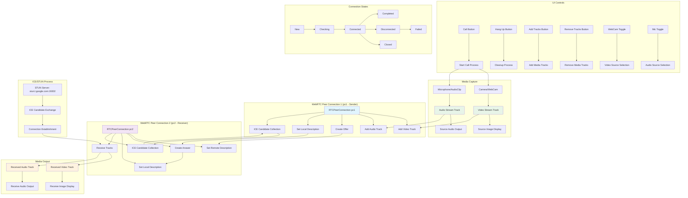

# WebRTC VideoReceiveSample System Diagram

## Theory of Operation

The VideoReceiveSample demonstrates a local WebRTC peer-to-peer connection where two RTCPeerConnection instances (pc1 and pc2) communicate with each other to simulate video and audio streaming.

## Key Components and Flow

### 1. Initialization Phase
- UI controls are set up with event listeners
- WebCam and microphone device lists are populated
- Event delegates are configured for peer connection callbacks

### 2. Call Establishment Phase
- **Media Capture**: Camera/WebCam and Microphone/AudioClip are captured
- **Peer Connection Creation**: Two RTCPeerConnection instances (pc1, pc2) are created
- **Track Addition**: Video and audio tracks are added to pc1
- **Offer/Answer Exchange**: 
  - pc1 creates an offer
  - pc1 sets local description with the offer
  - pc2 sets remote description with the offer
  - pc2 creates an answer
  - pc2 sets local description with the answer
  - pc1 sets remote description with the answer

### 3. ICE Candidate Exchange
- Both peer connections collect ICE candidates using STUN server
- Candidates are automatically exchanged between pc1 and pc2
- Connection state progresses: New ’ Checking ’ Connected ’ Completed

### 4. Media Streaming
- pc1 sends video and audio tracks to pc2
- pc2 receives tracks via OnTrack callback
- Received video is displayed in the receive image component
- Received audio is played through the receive audio component

### 5. Cleanup Phase
- All peer connections are disposed
- Media tracks are stopped and disposed
- UI controls are reset to initial state
- WebCam texture is stopped if active

## Technical Details
- Uses Unity's WebRTC package for peer-to-peer communication
- Supports both camera and WebCam video sources
- Supports both microphone and audio clip audio sources
- Implements proper graphics format conversion for WebCam textures
- Handles codec preferences for video streaming
- Provides comprehensive ICE connection state monitoring