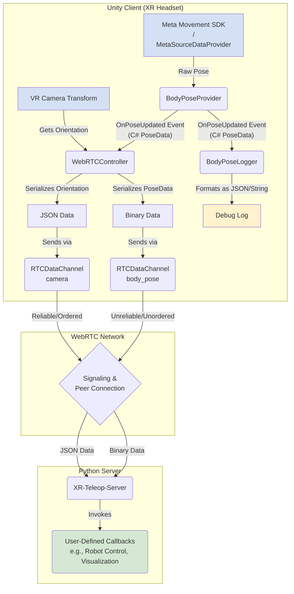

# XR-Robot-Teleop

`XR-Robot-Teleop` is a **robot teleoperation client for VR/AR headsets** built in Unity. It uses [Meta Movement SDK](https://developers.meta.com/horizon/documentation/unity/move-body-tracking/) to obtain upper body poses (via [inside-out body tracking](https://developers.meta.com/horizon/blog/inside-out-body-tracking-and-generative-legs/)) and sends it to a user-specified IP address via WebRTC. 

[`XR-Teleop-Server`](https://github.com/yunho-c/XR-Teleop-Server) is a companion project written in Python that receives the body pose data. You can define custom callback functions (which are invoked every time the data is received) to visualize body poses or integrate into a robotic simulator. 

## Instructions

### Installation

#### Option 1. Using Meta Quest Developer Hub

> This requires developer mode to be enabled on your Quest device. Refer to the instructions [here](https://developers.meta.com/horizon/documentation/native/android/mobile-device-setup/).

- Download the latest `.apk` file from [releases](https://github.com/yunho-c/XR-Robot-Teleop/releases).
- Connect your headset to computer (via USB-C cable).
- Open Meta Quest Developer Hub and the 'Devices' panel.
- Drag & drop the .apk file into the right side of the screen. 

### Option 2. Install from Meta App Lab

`TODO`: We have not yet uploaded the project to App Lab and will do so soon!

## Details

### Theory of Operation

### Hardware Compatibility

| Device | Supported | Notes |
| :--- | :---: | :--- |
| Meta Quest 3 | ✅ | fully supported |
| Meta Quest Pro | ⚠️ | untested |
| Apple Vision Pro | ❌ | not supported |

### Roadmap

[TODO: add roadmap link]

### Contribute

Please create an issue for feature requests and bug reports! PRs are welcome. 
