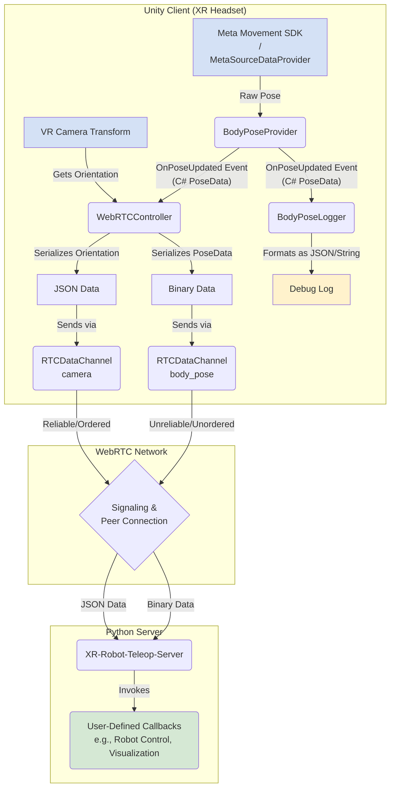

# XR-Robot-Teleop-Client

[`XR-Robot-Teleop-Client`](https://github.com/yunho-c/XR-Robot-Teleop-Client) is a **robot teleoperation client for VR/AR headsets** built in Unity. It uses [Meta Movement SDK](https://developers.meta.com/horizon/documentation/unity/move-body-tracking/) to obtain upper body poses (via [inside-out body tracking](https://developers.meta.com/horizon/blog/inside-out-body-tracking-and-generative-legs/)) and sends it to a user-specified IP address via WebRTC. 

[`XR-Robot-Teleop-Server`](https://github.com/yunho-c/XR-Robot-Teleop-Server) is a companion project written in Python that receives the body pose data. You can define custom callback functions (which are invoked every time the data is received) to visualize body poses or integrate into a robotic simulator. 

[TODO: video, GIF, or image]

## Instructions

### Installation

#### Option 1. Using Meta Quest Developer Hub

> This requires developer mode to be enabled on your Quest device. Refer to the instructions [here](https://developers.meta.com/horizon/documentation/native/android/mobile-device-setup/).

- Download the latest `.apk` file from [releases](https://github.com/yunho-c/XR-Robot-Teleop-Client/releases).
- Connect your headset to computer (via USB-C).
- Open [Meta Quest Developer Hub](https://developers.meta.com/horizon/documentation/unity/ts-mqdh/) and click the 'Devices' tab.
- Drag & drop the `.apk` file into the right-hand-side of the screen. 

#### Option 2. Install from Meta App Lab

`TODO`: We have not yet uploaded the project to App Lab — we will do so soon!

### Usage

- Obtain the IP address of your computer.
  - If the headset and PC are in a common network (e.g., same Wi-Fi router, university network, ...), you can generally use the local IP address which you can find by running `ipconfig`.
  - If the headset and PC are in different networks, you will need to perform the routine process (of setting up port-forwarding, opening firewall at a specific port, obtaining public IP, ...).
    - If you are unfamiliar with this, `Tailscale` is highly recommended—it greatly simplifies this process while providing rigorous security.
- Setup [`XR-Robot-Teleop-Server`](https://github.com/yunho-c/XR-Robot-Teleop-Server) Python package and clone its repository.
- Run one of its example scripts (e.g., `360-unity-teleop.py`).
  - Wait until it finishes loading and says: `TODO`.
- Open `XR-Robot-Teleop-Client` and enter the IP address of the PC, then press the connect icon.
- Voila!

## Details

### Theory of Operation



### Hardware Compatibility

| Device | Supported | Notes |
| :--- | :---: | :--- |
| Meta Quest 3 | ✅ | fully supported |
| Meta Quest Pro | ⚠️ | untested |
| Apple Vision Pro | ❌ | not supported |

### Roadmap

[TODO: add roadmap link]

### Contribute

Please create an issue for feature requests and bug reports! PRs are always welcome. 

## Collaboration

### Setup

Typcial location of UnityYAMLMerge:

- Windows: `TODO`
- macOS: `~/Documents/Unity/<version>/Contents/Tools/UnityYAMLMerge`
- Linux: `TODO`

```bash
git config merge.tool unityyamlmerge

git config mergetool.unityyamlmerge.cmd '<UnityYAMLMerge_path> merge -p "$BASE" "$REMOTE" "$LOCAL" "$MERGED"'

git config mergetool.unityyamlmerge.trustExitCode true
```

